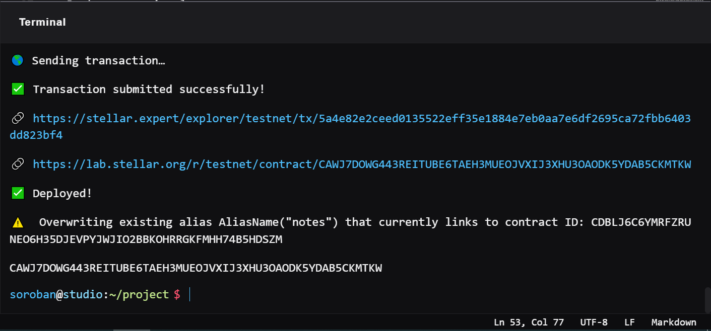
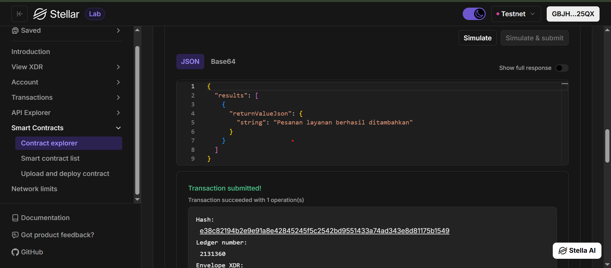

# Stellar PetCare DApp

**Stellar PetCare DApp** - Blockchain-Based Decentralized Pet Grooming & Boarding Service Management

## Project Description

Stellar PetCare DApp is a decentralized smart contract solution built on the Stellar blockchain using the Soroban SDK. It provides a secure, transparent platform for managing pet care services, specifically focusing on grooming and boarding (penitipan) with pick-up and drop-off tracking. The contract ensures that service orders and statuses are stored transparently on-chain, eliminating reliance on centralized database providers.

The system allows pet owners or shop admins to request services, track order statuses in real-time, view all active requests, and cancel services. By leveraging the efficiency and security of the Stellar network, every transaction and service update is uniquely identified and reliably stored.

## Project Vision

Our vision is to revolutionize the pet care service industry in the digital age by:

- **Decentralizing Data**: Moving service logs from centralized servers to a global, distributed blockchain.
- **Ensuring Transparency**: Providing verifiable service histories and real-time status updates (e.g., from "Waiting for Pickup" to "Completed").
- **Guaranteeing Immutability**: Providing a permanent, tamper-proof record of transactions and pet care histories.
- **Enhancing Trust**: Building a trustless system where agreements between pet owners and service providers are guaranteed by code.

We envision a future where pet service management is completely transparent, ensuring peace of mind for pet owners and operational efficiency for pet shops.

## Key Features

### 1. **Simple Service Request**

- Create service orders (Grooming or Boarding) with one function call.
- Store essential data: Owner's name, Pet's name, Service type, and Pick-up/Drop-off Address.
- Automated ID generation and default status initialization ("Menunggu Jemputan").

### 2. **Real-Time Status Tracking**

- Update the status of each service seamlessly as it progresses (e.g., "Sedang Grooming", "Selesai").
- Provides transparency for pet owners regarding their pet's current situation.

### 3. **Efficient Data Retrieval**

- Fetch all active and past service requests in a single call.
- Structured data representation for easy frontend integration (dashboard for shop admins).

### 4. **Secure Cancellation**

- Cancel or remove specific service requests using their unique IDs.
- Clean and efficient storage management for canceled orders.

### 5. **Stellar Network Integration**

- Leverages the high speed and low cost of Stellar.
- Built using the modern Soroban Smart Contract SDK.
- Scalable architecture for growing pet shop franchises.

## Contract Details

- Contract Address: CAWJ7DOWG443REITUBE6TAEH3MUEOJVXIJ3XHU3OAODK5YDAB5CKMTKW

## Future Scope

### Short-Term Enhancements

1. **Medical & Vaccine Records**: Store immutable vaccination and allergy records for each pet.
2. **Category & Pricing Management**: Add dynamic pricing based on pet size and selected service packages.
3. **Search & Filter**: Implement advanced search filters (by owner name or specific status) for the admin dashboard.

### Medium-Term Development

4. **On-Chain Payments**: Integrate Stellar USDC or native XLM for automated payment upon service completion.
5. **Notification System**: Off-chain bridge to alert users via email/SMS when their pet is picked up or ready to go home.
6. **Customer Loyalty Program**: Issue tokens or digital badges to frequent customers for discounts.

### Long-Term Vision

7. **Pet Identity NFTs**: Mint a unique, verifiable NFT for every pet registered in the system containing their full service and medical history.
8. **Decentralized UI Hosting**: Host the frontend on IPFS or similar decentralized platforms.
9. **Multi-Branch Synchronization**: Expand the contract logic to support multiple pet shop branches under one franchise.
10. **Inter-Contract Integration**: Allow vet clinics or pet insurance smart contracts to interact with the PetCare DApp data.

### Enterprise Features

11. **Immutable Auditing**: Create time-locked logs for employee performance and shop revenue audits.
12. **Automated Reporting**: Automatic daily/weekly summary triggers for shop managers.

---

## Technical Requirements

- Soroban SDK
- Rust programming language
- Stellar blockchain network

## Getting Started

Deploy the smart contract to Stellar's Soroban network and interact with it using the four main functions:

- `request_service()` - Create a new grooming/boarding order with pet and owner details.
- `update_status()` - Change the progress status of a specific order by its ID.
- `get_services()` - Retrieve all stored service requests from the contract.
- `cancel_service()` - Remove or cancel a specific service order by its ID.

## Testnet Deployment Screenshots

**Contract Deployment:**

**Function Execution:**

---

**Stellar PetCare DApp** - Securing Your Pet's Care on the Blockchain